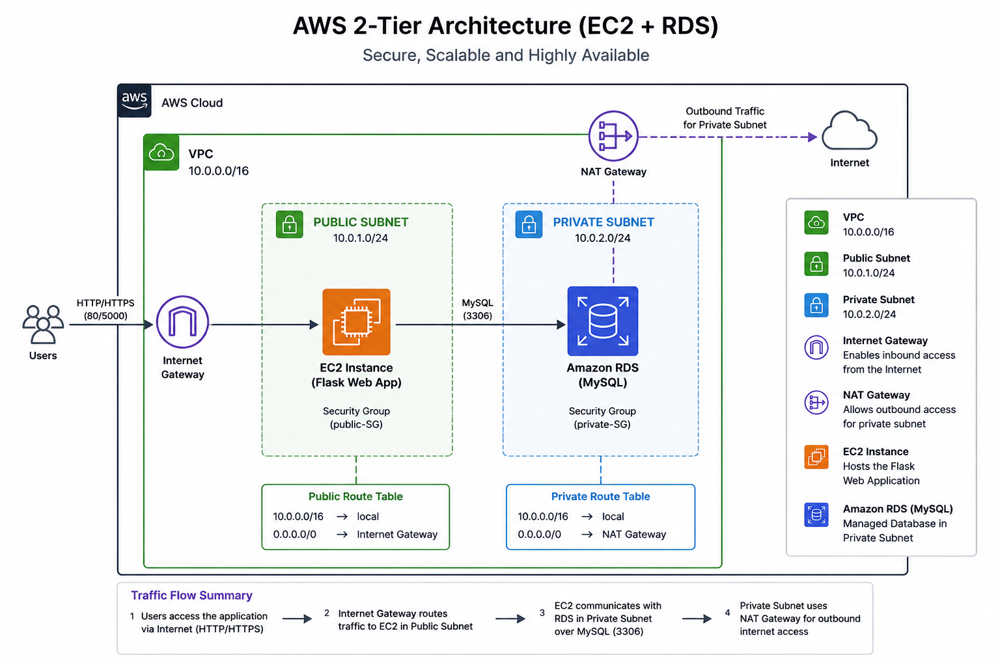
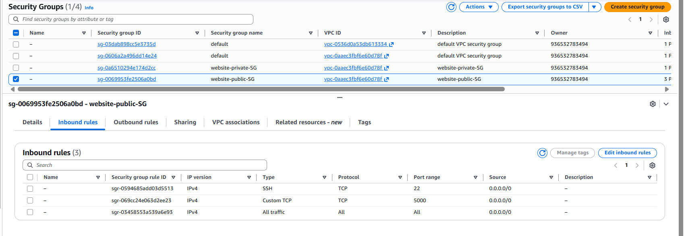
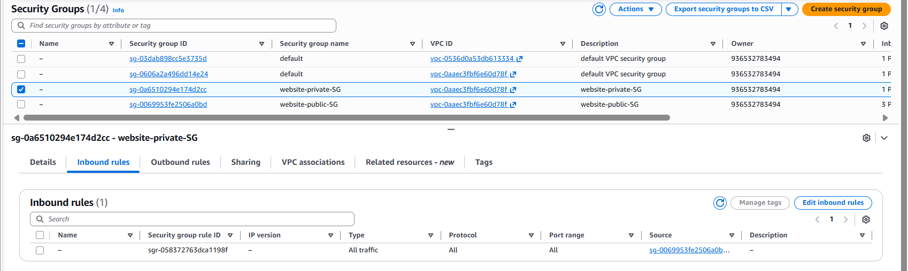
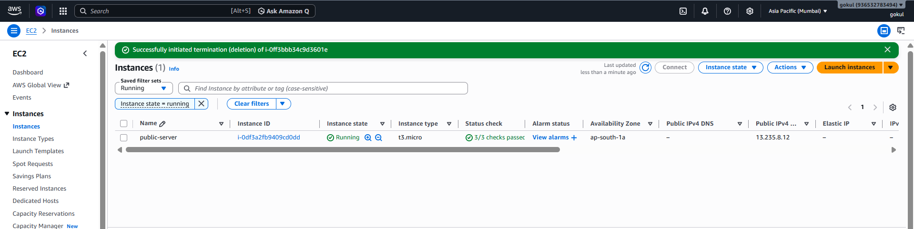
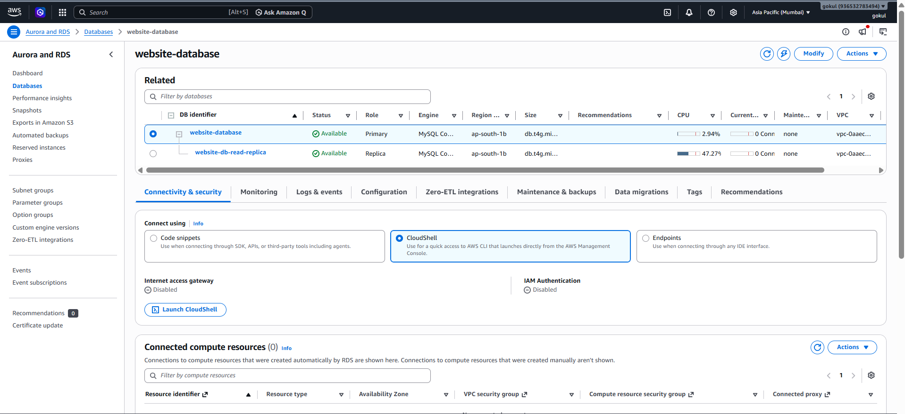

# 🚀 AWS 2-Tier Architecture Lab (EC2 + RDS)

## 📌 Overview

This project demonstrates a secure AWS architecture using **public and private subnets**, designed to host a web application with a database layer.

It uses:

* Internet Gateway (IGW) for public access
* NAT Gateway for controlled outbound internet
* Security Groups for secure communication

---

## 🧱 Architecture

* **VPC:** 10.0.0.0/16
* **Public Subnet:** 10.0.1.0/24
* **Private Subnet:** 10.0.2.0/24
* **EC2 (Public):** Flask Web Application
* **RDS (Private):** MySQL Database
* **Internet Gateway (IGW)**
* **NAT Gateway**
* **Route Tables controlling traffic**

---

## 🔄 Traffic Flow

### 🌐 Public Access

Internet → IGW → EC2 (Flask App)

### 🔒 Database Access

EC2 → RDS (Private Subnet via Security Groups)

### 🌍 Outbound Traffic (Private Subnet)

Private resources → NAT Gateway → Internet

---

## 📸 Screenshots

### 🏗️ VPC

---

### 🌐 Subnets

**Public Subnet**

**Private Subnet**

---

### 🚪 Internet Gateway

---

### 🔁 NAT Gateway

---

### 🧭 Route Tables

**Public Route Table**

**Private Route Table**

---

### 🖥️ Compute & Database

**EC2 Instance (Application Layer)**

**RDS MySQL (Database Layer)**

---

### 🔐 Security Groups

**Public Security Group (EC2)**

**Private Security Group (RDS)**

---

## 🧠 Key Learnings

* Difference between public and private subnets
* How IGW enables inbound internet access
* How NAT Gateway enables outbound-only access
* Secure EC2 → RDS communication using Security Groups
* Importance of route tables in traffic control

---

## 🧹 Cleanup

All resources should be deleted after testing to avoid AWS charges:

* Terminate EC2 instances
* Delete RDS instance
* Remove NAT Gateway (important 💸)
* Delete VPC and related resources

---
